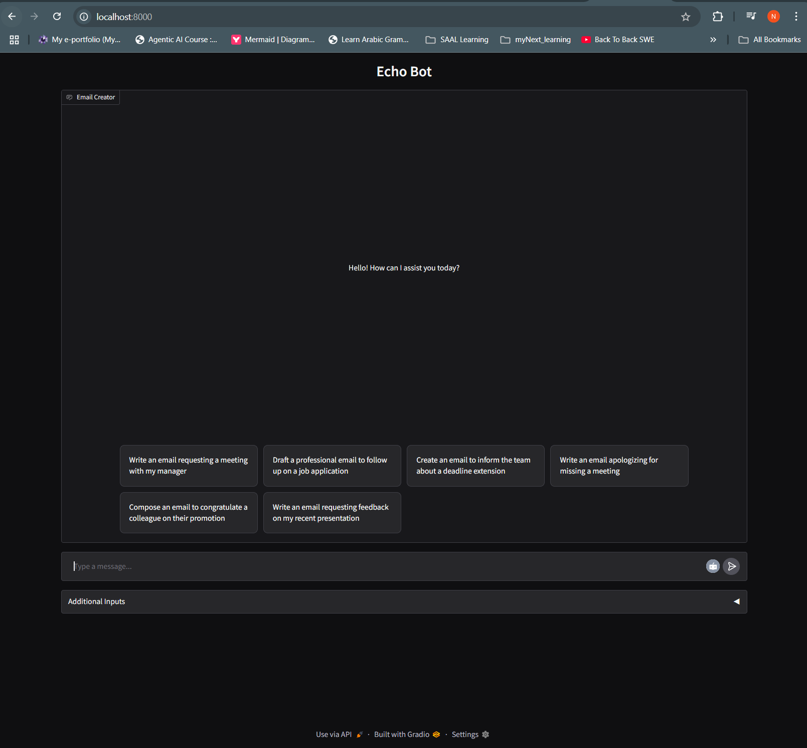
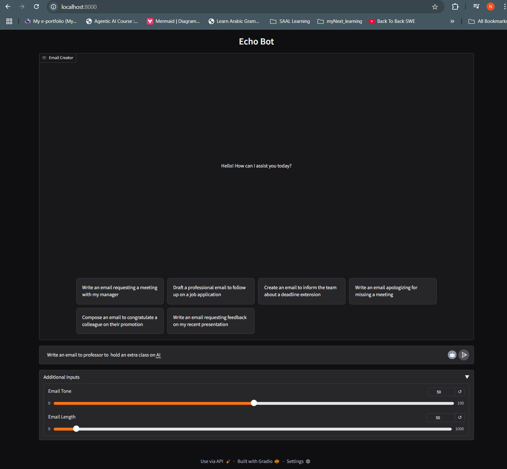
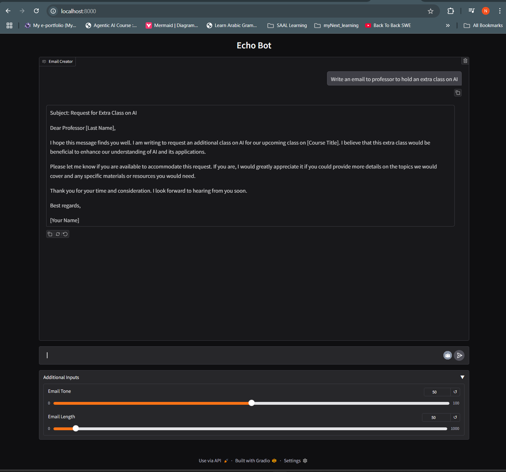
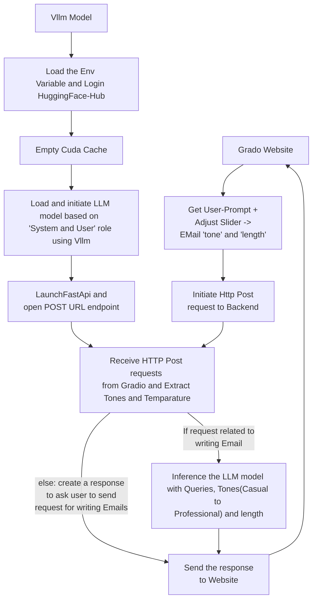

# <div align="center"> ✉️ LLM Powered Email Writer</div>

<div align="center">
  
  &nbsp;&nbsp;&nbsp;&nbsp;&nbsp;&nbsp;
  
  <p>
    <strong><u>Project 3:</u>&nbsp;&nbsp;AI-Powered Email Writing Assistant with VLLM & Gradio</strong>
  </p>
  <p>
    <em>Effortless, tone-aware email composition via a scalable, GPU-accelerated backend & modern web interface</em>
  </p>
  
  <p>
    <a href="#-live-demo">🚀 Live Demo</a> • 
    <a href="#-quick-installation">⚡ Quick Start</a> • 
    <a href="#-architecture">🧠 System Architecture</a> • 
    <a href="#-docker-deployment">🐳 Docker Deployment</a>
  </p>
  
  
  <p>
    
    
    
    
    
    
    
    
  </p>
</div>

---

## 🎯 About

The VLLM Qwen 2.5 0.5B Email Writer is an AI-powered assistant designed to help you write professional and personalized emails efficiently. It uses a state-of-the-art Qwen 2.5 0.5B instruction-tuned language model hosted with VLLM for GPU-accelerated inference, paired with an intuitive Gradio-based frontend.

**🔬 Key strengths:**
- Compose emails with customizable tone (informal to formal-professional)
- Control email length for concise or detailed messages
- Strict domain focus: only assists with email writing, guiding users to rephrase unrelated queries
- Scalable, GPU-accelerated backend using VLLM and PyTorch
- Interactive, easy-to-use web interface with Gradio
- Dockerized architecture for simple local or cloud deployment


## ✨ Key Features

- **📨 Email Drafting Assistant:** Write emails for meetings, follow-ups, apologies, congratulations, and more
- **🎚️ Tone Slider:** Adjust the tone from casual to highly professional
- **📏 Length Slider:** Control the length (word count) of generated emails
- **🔄 Chat Interface:** Message-based UI with chat bubbles, markdown rendering, and copy button
- **⚙️ Robust Backend:** FastAPI REST API serving VLLM model inference
- **🐳 Containerized Deployment:** Separate Docker images for frontend and backend, orchestrated via docker-compose
- **🖥️ GPU Utilization:** Supports Nvidia GPUs for accelerated language model inference

## 🌟 Live Demo
**[🚀 Try the Live Demo](http://localhost:8000/)**

### 📸 Application Screenshots
<div align="center">
  <!-- ADD YOUR SCREENSHOTS HERE -->
  
  <p><em>Main Recommendation Interface</em></p>
  
  
  
  <p><em>Enter User ID and Current Movie and also can give some rating on movie</em></p>
</div>


## 🧠 Model Architecture

### 🔄 Approach Overview


## System Components:

### 1. **FrontEnd - Gradio UI (ui.py)**
- **Interface:** Gradio Chat-Interface, Email tone(Casual to Professional) and length slider
- **Functionality**:
  - Accepts user message 
  - Convert UI state to JSON payload
  - Sends request to backend REST API (/askQuestion) 

- **Technologies**: 
  - gr.Interface, custom components for sliders & textboxes
  - Markdown rendering for responses
  - Button to copy output email

### 2. **API Layer – FastAPI App (main.py)**:
  - **Route**: /askQuestion (POST)
  - **Receives**: JSON payload with
    - **prompt**: User Message
    - **tone**: value from 0 (casual) to 100 (very professional)
    - **length**: range from 50 to 1000 words

- **Core Logic**:
  - Preprocesses user input
  - Constructs structured system prompt for Qwen2.5
  - Calls vllm_engine.generate() for inference
  - Filters response for formatting
  - **Returns**:  JSON output containing the final email text

### 3. **Model Backend - VLLM Runtime**:
  - **Model Used**: Qwen2.5-0.5B-Instruct
  - **System Prompt Template**: Instruct LLM model to generate responses only for email generation and skip other conversational prompt
  - **User Prompt Template**: Custom email template with tone and length hints
  - **Deployment**: Docker & GPU Support


### 4. **Deployment - Docker & GPU Support**:
  - **Frontend Container**: 
    - **Base**: continuumio/anaconda3
    - **Ports**: Host 8000 → Container 8710

  - **Backend Container**:
    - **Base**: continuumio/anaconda3
    - **Ports**: Host 8010 → Container 8709
    - **Libs**: torch, vllm, fastapi, python-dotenv

## 🛠️ Technology Stack

<div align="center">

**ML & LLM**: 


**UI & Visualization**


**Development & Deployment**


</div>


## 📝 Project  app.py class Structure
```
├── class GradioUi                         
│   ├── 📄 __init__()              
│   ├── 📄 respond(message, history, tone, length)  
│   └── 📄 launchBot()

```
---
## 📝 Project  main.py (backend) class Structure
```
├── class ModelCall                         
│   ├── 📄 __init__(llm, top_p: float = 0.95, max_tokens: int = 512)             
│   └── 📄 makeQuery(query, tone:float=0.8, length:int=100)  
│   
├── def create_app(modelName)
└── def main() 
```

### 🎯 Basic Usage

  - **ui.py**:
    ```python
    class GradioUi(): 
          . 
          .  
          .  
          .  
          . 
  
      def launchBot(self): 
          chat = gd.ChatInterface(
              fn=self.respond,
              chatbot=self.chatbot,
              title="Echo Bot",                             # add your preferred Bot title name
              theme="default",
              examples=[                                    # change or add more examples if needed
                  ["Write an email requesting a meeting with my manager"],
                  ["Draft a professional email to follow up on a job application"],
                  ["Create an email to inform the team about a deadline extension"],
                  ["Write an email apologizing for missing a meeting"],
                  ["Compose an email to congratulate a colleague on their promotion"],
                  ["Write an email requesting feedback on my recent presentation"]
              ],
              type="messages",
              save_history = False, 
              fill_height=True,
              stop_btn = True,
              autoscroll	=True,
              additional_inputs=[                          # can modify the tone and email length slider
                  gd.Slider(minimum=0, maximum=100, step=1, value=50, label="Email Tone "), 
                  gd.Slider(minimum=0, maximum=1000, step=1, value=50, label="Email Length")
              ],
              css="#mychatbot{height: 65vh}"
          )
    ```

### 🔧 Advanced Configuration for LLM model
  - **Create a '.env' file inside 'vllm_model' folder and inside .env file use below snippet**:
  ```text
  keys = "here paste your huggingface-hub token"
  ```
```python
def main():
    .  
    .  
    .  
    .  
    .  
    model_name = "unsloth/Qwen2.5-0.5B-Instruct"  # here you can use different LLM model from huggingface according to you VRAM size
    llm = LLM(model=model_name, dtype="float16") # you can change the data-type if needed
    .  
    .  
    . 
    .  
```

## 📦 Installation & Setup

### Prerequisites
``` text
• Docker & Docker Compose installed
• Nvidia GPU with CUDA drivers (for backend inference)
• Internet access to pull Docker images and model weights
```
```bash
Python==3.10
gradio
huggingface_hub
numpy
pandas
torch
Git
```

### ⚡ Quick Installation Using Docker Compose
1. **Clone the Repository**
   ```bash
   https://github.com/NiazMahmud2001/emailWriterProject.git
   cd emailWriterProject
   ```

2. **Build and start containers in docker**
   ```bash 
   docker-compose up --build
   ```
3. **Open your browser at**
   ```bash 
   http://localhost:8000
   ```


## 🤝 Contributing

We welcome contributions from the community! Here's how you can help:

### 🎯 Areas for Contribution
- 🎨 **UI/UX Enhancement** - Better user interface design
- 🔧 **Code Optimization** - Performance improvements
- 📚 **Documentation** - Better guides and tutorials
- 🐛 **Bug Fixes** - Issue resolution


## 📚 Additional Resources

### 📖 Learning Materials
- [Three Tier Architecture](https://www.geeksforgeeks.org/dbms/introduction-of-3-tier-architecture-in-dbms-set-2/)
- [Dockerize VLLM model](https://docs.vllm.ai/en/stable/deployment/docker.html)
- [List of LLM models supported by VLLM](https://docs.vllm.ai/en/v0.7.0/models/supported_models.html)
- [Gradio Documentation](https://gradio.app/docs/)


## 📞 Contact & Support

**👨‍💻 Developer:** Niaz Mahmud
- **GitHub:** [@NiazMahmud](https://github.com/NiazMahmud2001?tab=repositories)
- **LinkedIn:** [LinkedIn Profile](www.linkedin.com/in/niaz-mahmud-5b158b245)
- **Email:** [U21102204@sharjah.ac.ae](mailto:U21102204@sharjah.ac.ae)

---

<div align="center">
  <p><strong>Made with ❤️ and lots of ☕</strong></p>
  <p>⭐ <strong>Star this repository if you found it helpful!</strong> ⭐</p>
</div>
